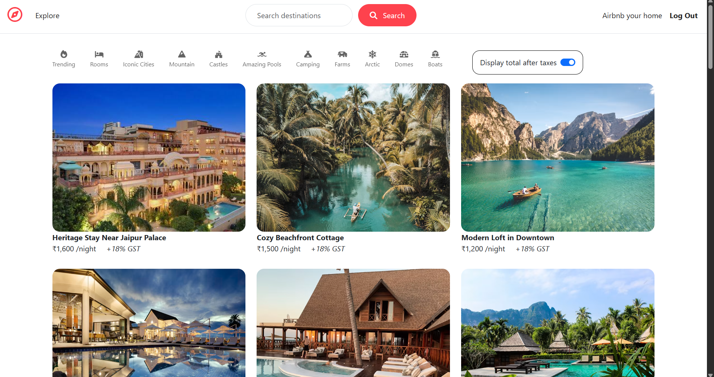
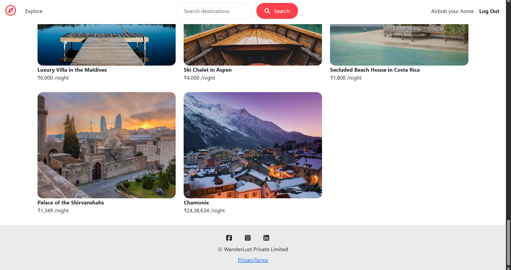
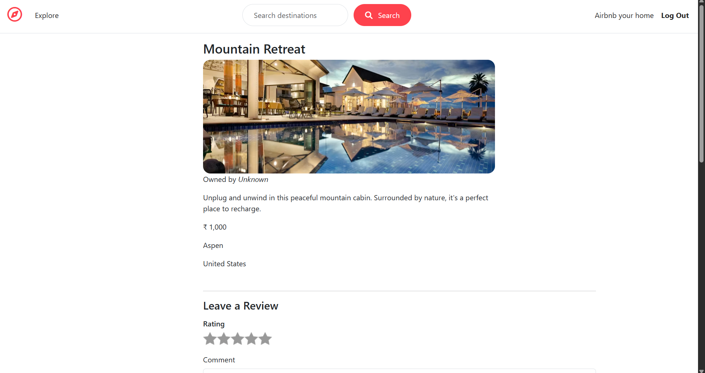
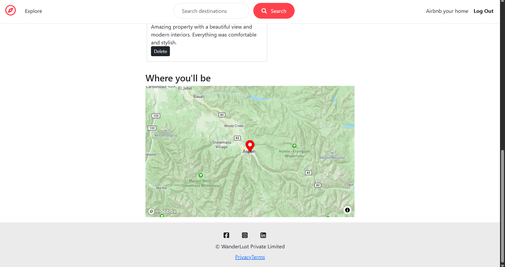
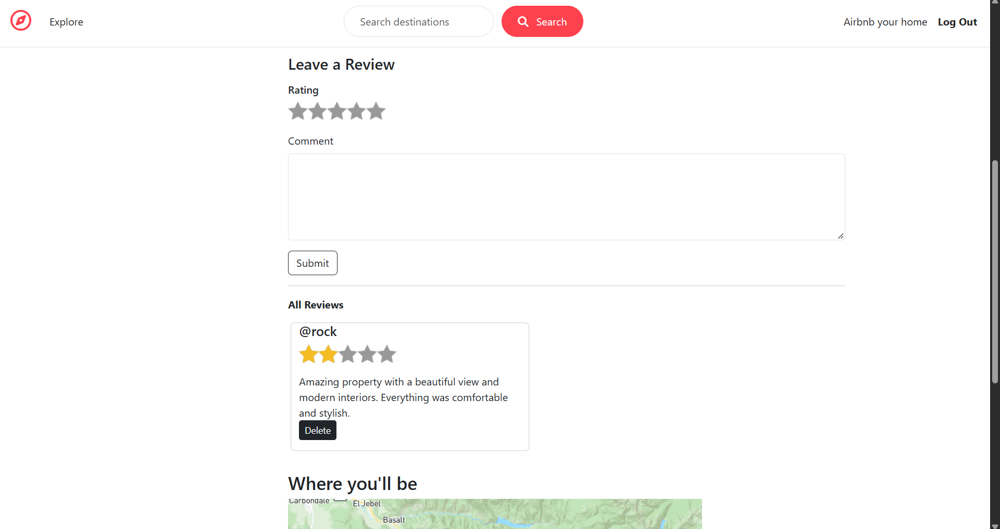
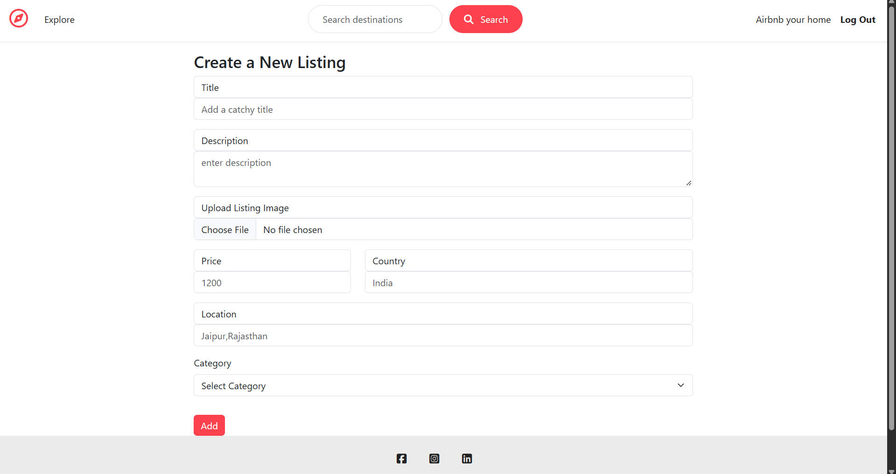
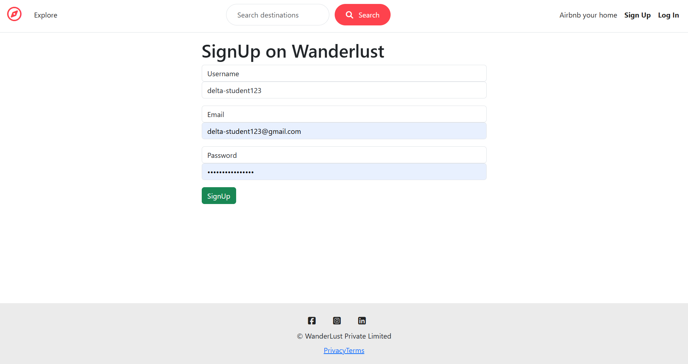
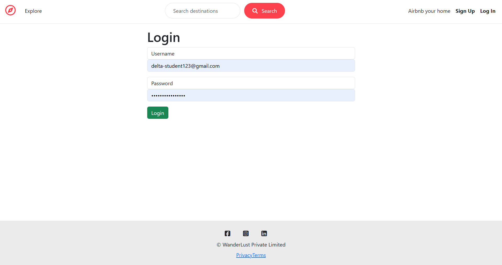

# WanderLust

WanderLust is a full-stack vacation rental listing platform inspired by Airbnb. Users can browse property listings, create accounts, add their own listings, edit or delete listings, leave reviews, and view property locations on an interactive map.

## Live Demo

[Visit WanderLust](https://wanderlust-438i.onrender.com/listings)

## Table of Contents

- [Features](#features)
- [Tech Stack](#tech-stack)
- [Screenshots](#screenshots)
- [Prerequisites](#prerequisites)
- [Installation](#installation)
- [Usage](#usage)
- [Project Structure](#project-structure)
- [Future Features](#future-features)
- [Known Issues](#known-issues)
- [Acknowledgments](#acknowledgments)
- [Author](#author)
- [License](#license)

## Features

- Browse vacation rental listings
- View individual listing details
- Create, edit, and delete listings
- User authentication and authorization
- Owner-only edit and delete controls
- Search and category-based listing filters
- Leave and view reviews with star ratings
- Interactive location maps using Mapbox
- Image uploads using Cloudinary
- Responsive Airbnb-inspired interface

## Tech Stack

- **Frontend:** EJS, HTML, CSS, Bootstrap, JavaScript
- **Backend:** Node.js, Express.js
- **Database:** MongoDB and Mongoose
- **Authentication:** Passport.js
- **Image Storage:** Cloudinary
- **Maps:** Mapbox
- **Deployment:** Render

## Screenshots

### Browse Listings



### Listing Details


### Location Map


### Reviews


### Create a New Listing


### Sign Up


### Log In


## Prerequisites

Before you begin, make sure you have the following installed and set up:

- [Node.js](https://nodejs.org/) (v18 or higher recommended)
- [MongoDB Atlas](https://www.mongodb.com/cloud/atlas) account (or a local MongoDB installation)
- A [Cloudinary](https://cloudinary.com/) account for image storage
- A [Mapbox](https://www.mapbox.com/) account for the access token

## Installation

1. Clone the repository:

   ```bash
   git clone https://github.com/YashPawar007/Wanderlust.git
   ```

2. Move into the project folder:

   ```bash
   cd Wanderlust
   ```

3. Install dependencies:

   ```bash
   npm install
   ```

4. Create a `.env` file in the root folder and add your environment variables:

   ```env
   ATLASTDB_URL=your_mongodb_connection_string
   SECRET=your_session_secret
   CLOUD_NAME=your_cloudinary_cloud_name
   CLOUD_API_KEY=your_cloudinary_api_key
   CLOUD_API_SECRET=your_cloudinary_api_secret
   MAP_TOKEN=your_mapbox_access_token
   ```

   | Variable | Where to get it |
   |---|---|
   | `ATLASTDB_URL` | Your MongoDB Atlas connection string (or local MongoDB URI) |
   | `SECRET` | Any random string you choose, used to sign session cookies |
   | `CLOUD_NAME`, `CLOUD_API_KEY`, `CLOUD_API_SECRET` | From your Cloudinary dashboard |
   | `MAP_TOKEN` | From your Mapbox account's access tokens page |

5. Start the application:

   ```bash
   node app.js
   ```

6. Open the app in your browser:

   ```text
   http://localhost:8080/listings
   ```

## Usage

1. **Sign up** for a new account or **log in** if you already have one.
2. **Browse listings** on the homepage, or use the search bar and category filters to narrow results.
3. Click any listing to **view its details**, including price, location, and an interactive map.
4. **Leave a review** with a star rating and comment on any listing.
5. Click **"Airbnb your home"** to **create a new listing** with a title, description, image, price, location, and category.
6. If you own a listing, you'll see **edit and delete controls** on that listing's page.

## Project Structure

```text
MAJORPROJECT/
├── models/          # MongoDB models
├── routes/          # Express routes
├── controllers/     # Route controllers
├── views/           # EJS templates
├── public/          # CSS and client-side JavaScript
├── utils/           # Error handling utilities
├── screenshots/      # App screenshots used in this README
├── app.js           # Main application entry point
└── package.json     # Dependencies and scripts
```

## Future Features

- Online booking and availability calendar
- Payment gateway integration
- Wishlist / saved listings
- Sorting and advanced filtering of reviews
- Host dashboard with listing analytics

## Known Issues

- No booking or payment system yet — listings are for browsing only
- Limited form validation on the client side
- No pagination on the listings page for large datasets

## Acknowledgments

- [Bootstrap](https://getbootstrap.com/) for UI components
- [Mapbox](https://www.mapbox.com/) for interactive maps
- [Cloudinary](https://cloudinary.com/) for image hosting
- Inspired by [Airbnb](https://www.airbnb.com/)'s design and user experience

## Author

**Yash Pawar**

- GitHub: [YashPawar007](https://github.com/YashPawar007)
- LinkedIn: [Yash Pawar](https://www.linkedin.com/in/yashpawar0999)

## License

This project is licensed under the [MIT License](LICENSE) — see the LICENSE file for details.